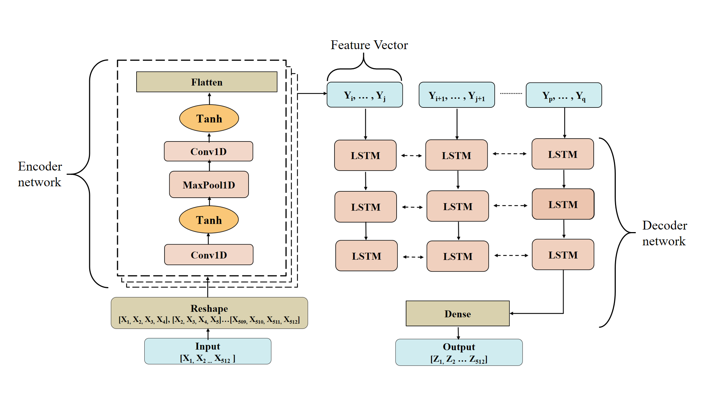

# GW-Denoiser: A Deep Learning Model for Gravitational Wave Denoising
This repository is the implementation of the paper [Extraction of Binary Black Hole Gravitational Wave Signals in Detector Data Using Deep Learning](https://journals.aps.org/prd/abstract/10.1103/PhysRevD.104.064046) by Chayan Chatterjee, Linqing Wen, Foivos Diakogiannis and Kevin Vinsen.  

The aim of this work is to implement a neural network model, called denoising autoencoder, to extract binary black hole gravitational wave signals from stationary Gaussian and real detector noise. A denoising autoencoder is a deep learning architecture that consists of two neural networks, called an encoder and a decoder. Together, these two networks produce clean, noise-free versions of corrupted or noisy input data. The encoder compresses noisy data into a low-dimensional feature vector and the decoder reconstructs the pure input data, with noise removed from the compressed feature vector.
We have used a [Convolutional Neural Network](https://en.wikipedia.org/wiki/Convolutional_neural_network) as our encoder and a [Bi-directional Long Short Term Memory Network](https://en.wikipedia.org/wiki/Long_short-term_memory) as our decoder. The architecture of the model is shown below: 

This is the first successful application of deep learning to denoise all ten binary black hole gravitational wave signals from real detector strain data at > 97% overlaps with pure waveform templates. We have also demonstrated that our model is robust against modelled glitches and non-injection samples, or pure noise. 

This code is written in Python and uses the [TensorFlow 2](https://www.tensorflow.org/) package.

# Sample Generation
The training and test set samples used for this work were generated using the repository [damonbeveridge/samplegen](https://github.com/damonbeveridge/samplegen), which adds additional features to the sample generation code written by Timothy Gebhard and Niki Kilbertus described in the paper [Convolutional neural networks: A magic bullet for gravitational-wave detection?](https://journals.aps.org/prd/abstract/10.1103/PhysRevD.100.063015) 

# Usage
To train the model, run the ```main.py``` file:
```
python main.py
```
